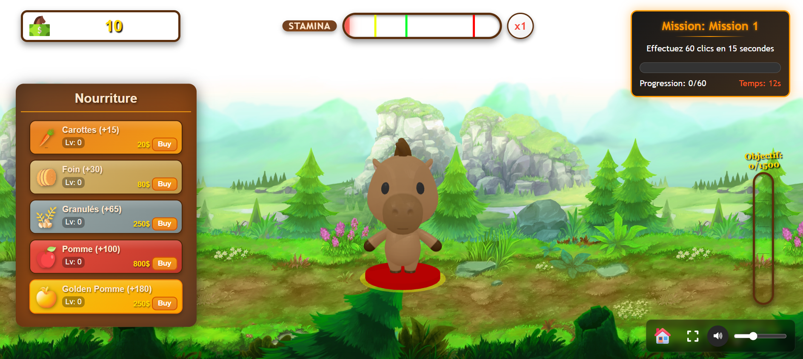

# Horse CLICKER

Un jeu clicker interactif en 3D où vous prenez soin d'un cheval virtuel.



## Description

Horse CLICKER est un jeu de type "clicker" développé en web. Cliquez sur le cheval pour gagner des ressources, achetez de la nourriture pour augmenter son niveau de nourriture et sa barre de stamina. Plus la stamina augmente, meilleurs sont vos multiplicateurs de points !

Votre objectif final est de remplir la jauge jusqu'à 1500 points tout en accomplissant diverses missions qui apparaîtront au cours du jeu.

## Fonctionnalités principales

- **Système de clics interactif** : Cliquez sur le cheval 3D pour gagner de l'argent 
- **Gestion de ressources** : Achetez de la nourriture pour augmenter le multiplicateur
- **Barre de stamina** : Augmentez la stamina pour obtenir de meilleurs multiplicateurs
- **Système de missions** : Complétez diverses missions qui apparaissent pendant le jeu
- **Modèles 3D** : Visualisation du cheval en 3D grâce à Three.js
- **Objectif final** : Remplir la jauge principale à 1500 points

## Technologies utilisées

- HTML5
- CSS3
- JavaScript
- Three.js (pour les modèles 3D)
- Vite (bundler)
- Git LFS (pour le stockage des fichiers volumineux)

## Prérequis

- Node.js (version recommandée : 14.x ou supérieure)
- NPM ou Yarn

## Installation

1. Clonez le dépôt Git :
```bash
git clone https://github.com/votre-username/horse-clicker.git
cd horse-clicker
```

2. Installez les dépendances :
```bash
npm install
```

3. Lancez le serveur de développement :
```bash
npx vite
```

4. Ouvrez votre navigateur à l'adresse indiquée (généralement http://localhost:3000)

## Utilisation de Git LFS

Ce projet utilise Git Large File Storage (LFS) pour gérer les fichiers 3D volumineux (GLTF et GLB). Si vous souhaitez contribuer ou cloner le projet, assurez-vous d'avoir Git LFS installé :

```bash
git lfs install
git lfs pull
```

## Structure du projet
```
CHEVALCLICKER/
├── node-modules/
├── src/
│   ├── assets/         # Modèles 3D FBX/GLB et textures
│   ├── css/            # Styles CSS
│   ├── images/         # Images
│   ├── js/             # Fichiers javascript
│   ├── sound/          # Musique du jeu
│   └── index.html      # Page principale
├── package-lock.json
├── package.json        # Configuration Vite
└── README.md           # Ce fichier

```

## Auteurs
``` bash
Wael ZEIN   
Guillaume Leleux
Martin Mollat
```

Amusez-vous bien avec HORSE CLICKER ! 🐴